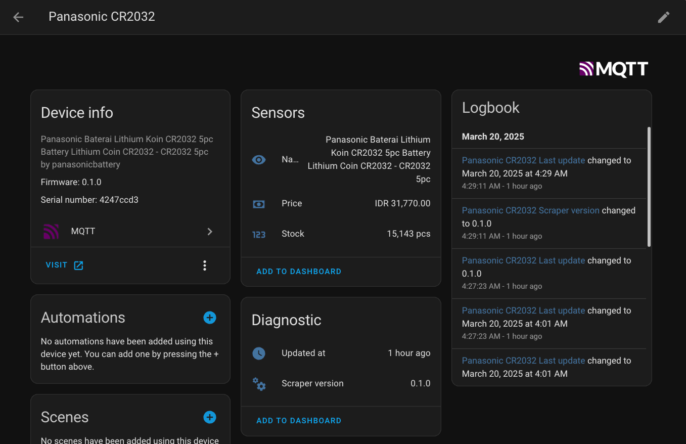

[](https://wakatime.com/badge/github/angeloanan/ha-tkpd-tracker)

# Home Assistant <> Tokopedia Tracker



A simple schedulable executable for tracking Tokopedia item on Home Assistant via MQTT.

Currently able to track the name, price and stock of a listing.

## Motivation

We, Indonesians, live in a voucher-full / discount-full / promo-full culture where we are able quench our thirst to buy something until the price has gone down via discounts and promotions or until we found a better alternative.

Sadly, this cultural behavior has been abused by most, if-not all, shop and seller to the point of having a "flash-sale" events of up to 90% discounts[^1] which occurs randomly or more predictably, on a schedule of repeating calendar date (`10.10.` AKA 10th of October, `11.11.` AKA 11th of November, `12.12.` AKA 12th of Decemeber, etc). You can say that these are the "black-friday"s of Indonesia.

A friend of mine wanted to track the prices of some items and figured that they wouldn't be able to since [Tokopedia](https://tokopedia.com), the largest e-commerce platform in Indonesia, does not provide the capability to do so[^2]. So after the repeated pain of missing said discounts, they reached out to me and I agreed to build this tool.

## Usage

This guide assumes that you have **Home Assistant** and an **MQTT broker** connected to it.

Download the latest release from the [releases page](https://github.com/angeloanan/ha-tkpd-tracker/releases) or development build via [commit workflows](https://github.com/angeloanan/ha-tkpd-tracker/actions/workflows/dev.yml).

Allow the app to be runnable by `chmod +x ha-tkpd`.

Run the app with the Tokopedia Item URL you want to track as an argument

```sh
$ ./ha-tkpd https://tokopedia.com/myshop/example-item-21e0
```

You can also use the `--help` flag to get a list of all available options:

```bash
$ ./ha-tkpd --help
Track Tokopedia prices on Home Asssistant via MQTT

Usage: ha-tkpd [OPTIONS] <URL>

Arguments:
  <URL>  The Tokopedia URL for a price to be tracked

Options:
  -u, --username <MQTT_USERNAME>         MQTT Broker username if required
  -p, --password <MQTT_PASSWORD>         MQTT Broker password if required
  -s, --server <MQTT_SERVER>             MQTT Broker host or IP [default: localhost]
  -x, --port <MQTT_PORT>                 MQTT Broker port [default: 1883]
  -t, --topic <HA_MQTT_DISCOVERY_TOPIC>  HA MQTT autodiscover topic [default: homeassistant]
  -d, --delete                           When set, deletes existing data & connection from HA
  -h, --help                             Print help
  -V, --version                          Print version
```

## Scheduling

> [!CAUTION]
> **Limit the executable to run AT THE MOST 4 calls per item per day**
>
> Unless your intention is to track / chart item stock on HA, it really does not make sense to have more than 1 call per day.


This program is designed to be run on a schedule by some other automation tool like [cron](https://linuxize.com/post/scheduling-cron-jobs-with-crontab/), [node-red](https://nodered.org/) or [n8n](https://n8n.io/).

To use it with **cron**, you can copy & modify the following to crontab:

```cron
0 10 * * * /path/to/ha-tkpd https://www.tokopedia.com/shop/product-id-18a8
```

The above expression will run `ha-tkpd` everyday at 10 AM local time.

If you have multiple items to be tracked, I recommend staggering each call by 1 minute (10:00 then 10:01 then 10:02 etc).

## Building

This project uses [Rust](https://www.rust-lang.org/) and [Cargo](https://doc.rust-lang.org/cargo/).

You do not need to have OpenSSL installed to build the project as the project uses the [rustls](https://github.com/rustls/rustls) crate to provide TLS support.

To build the project, clone the repository and run `cargo build --release`.

```bash
git clone https://github.com/angeloanan/ha-tkpd-tracker.git
cd ha-tkpd-tracker
cargo build --release
```

## Contributing

Contributions are welcome, though not expected and not guaranteed to be merged; this is a personal project after all.

Feel free to fork and adapt this project to your needs.

[^1]: Realistically, the price of these items are gouged beforehand
[^2]: On the time I'm writing this, you can only get notifications if an item is back on stock. Such notification is not separated with other marketing / promotions related notification

